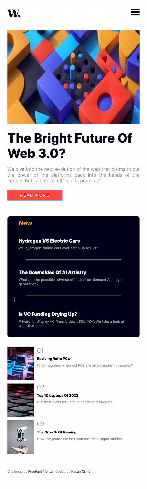
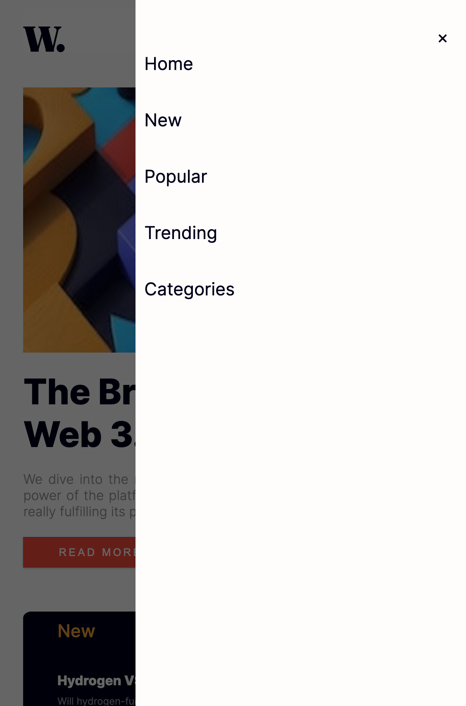
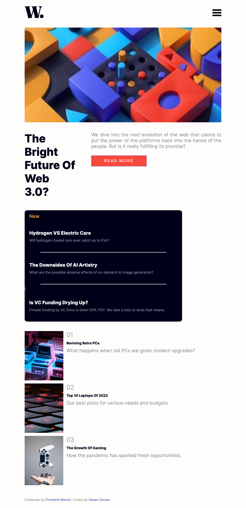

# Frontend Mentor - News homepage solution #

This is a solution to the [News homepage challenge on Frontend Mentor](https://www.frontendmentor.io/challenges/news-homepage-H6SWTa1MFl). Frontend Mentor challenges help you improve your coding skills by building realistic projects.

## Table of contents ##

- [Overview](#overview)

  - [The challenge](#the-challenge)

  - [Screenshots](#screenshots)

  - [Links](#links)

- [My process](#my-process)

  - [Built with](#built-with)

  - [What I learned](#what-i-learned)

  - [Continued development](#continued-development)

  - [Useful resources](#useful-resources)

- [Author](#author)

- [Acknowledgments](#acknowledgments)

## Overview ##

### The challenge ###

Users should be able to:

- View the optimal layout for the interface depending on their device's screen size
- See hover and focus states for all interactive elements on the page.

Please see the section below for screenshots of:

- mobile view
- mobile slide-out menu view
- tablet view
- desktop view.

### Screenshots ###

### Links ###

- Solution URL: [github.com/hasanosman2020/FrontendMentor](https://github.com/hasanosman2020/FrontendMentor)

- Live Site URL: [frontendmentor-news-homepage.netlify.app](https://frontendmentor-news-homepage.netlify.app)

### My process ###

### Built with ###

- Semantic HTML5 markup
- CSS custom properties

- Flexbox

- CSS Grid

- Mobile-first workflow

- Vanilla JavaScript

### What I learned ###

I found this to be challenging. It took me longer than expected and I ended up rewriting the code on two separate occasions. It was a very steep learning curve but managed to incorporate using Flex, CSS Grid and plain, vanilla JavaScript in my app. I am aware that my CSS is probably far too long and can be cut down in a major way - any suggestions on that, or on any other apsects of the code, will be greatly appreciated.  I have created a tablet view as I thought it would be a good learning opportunity.

### Continued development ###

I shall continue focusing on Flexbox, CSS Grid and JavaScript. Further practice with Flexbox is required in order for me to better understand some of the concepts involved and how to implement them. I would also like to learn more about CSS Grid and how to use it effectively. I would like to learn more about JavaScript and how to use it to create more interactive web pages.  

### Useful resources ###

- [MDN - Basic Concepts of F    lexbox](https://developer.mozilla.org/en-US/docs/Web/CSS/CSS_Flexible_Box_Layout/Basic_Concepts_of_Flexbox#alignment_justification_and_distribution_of_free_space_between_items) - This helped me understand some of the basic concepts of CSS Flexbox. I'd recommend it to anyone learning the concepts of CSS Flexbox.

- [CSS Grid Layout](https://developer.mozilla.org/en-US/docs/Web/CSS/CSS_Grid_Layout) - This helped me to understand and implement the concepts of CSS Grid.
- [W3 Schools](https://www.w3schools.com/)
- [Tuts Plus](https://tutsplus.com/)
- This is a great resource which helped me with the JavaScript code for the mobile slide-out menu. It is an excellent website in general with very helpful tutorials and articles.  

## Author ##

- Website / Github - [Hasan Osman](https://github.com/hasanosman2020)

- Frontend Mentor - [@hasanosman2020](https://www.frontendmentor.io/profile/hasanosman2020)

- Twitter - [@Hasan79Hoa](https://www.twitter.com/Hasan79Hoa)
